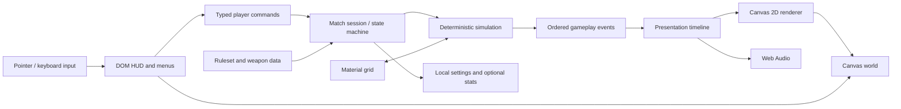

# Архитектура

- **Статус:** реализовано для vertical slice; расширение требует профилирования
- **Обновлено:** 2026-07-28

## 1. Движущие ограничения

- Игра запускается по URL в современном mobile Chrome-class и desktop
  Chrome-class браузере. Более широкая совместимость — будущая цель после
  проверки baseline.
- Основной язык — TypeScript.
- Бой двухмерный, но рельеф содержит туннели и нависающий материал.
- Яркие VFX — основная производственная нагрузка и часть продукта.
- Каноническая механика должна воспроизводиться независимо от frame rate,
  renderer и качества графики.
- MVP не требует сервера, аккаунта и сетевой синхронизации.

Главные качества: детерминизм, читаемость, mobile performance, простое
добавление оружия и тестируемость баланса.

## 2. Текущий стек

| Область | Решение | Почему |
|---|---|---|
| Язык | TypeScript в strict mode | проверяемые данные оружия и границы систем |
| Сборка | vinext + Vite | локальный HMR и совместимый с ChatGPT Sites server bundle |
| UI | React 19 и семантический DOM/CSS поверх canvas | крупные touch-controls, layout и доступность вне renderer |
| Renderer | Canvas 2D | прямое обновление terrain bitmap и достаточный vertical-slice budget |
| Симуляция | собственные pure TypeScript modules | готовая rigid-body physics не описывает пиксельный рельеф и правила оригинала |
| Audio | typed event plans + Web Audio director | user gesture, отдельные buses, без внешних ассетов |
| Хранение | match в памяти, audio settings в localStorage | vertical slice не требует аккаунтов |
| Unit tests | Vitest | быстрые детерминированные тесты домена |
| Render smoke | Node test против production worker | проверка HTML, metadata и Sites bundle |

Версии зафиксированы в lockfile. Принятое решение и критерий перехода на
WebGL/framework описаны в
[ADR 0002](decisions/0002-vertical-slice-architecture.md).

## 3. Граница текущего renderer

Canvas 2D принят как самый короткий путь к проверяемому vertical slice. Он
покрывает terrain bitmap, несколько projectile, trails, частицы, camera shake
и DOM-overlay без второго источника игрового состояния.

Перед дальнейшим ростом плотности VFX нужен frame-time trace на среднем
Android-устройстве. Если измерения покажут системное ограничение fill rate или
числа эффектов, кандидатами остаются PixiJS/Phaser с WebGL. Миграция не должна
менять `lib/game/`, seed, баллистику, damage или каталог оружия.

## 4. Контейнеры и потоки

### Domain

Чистые TypeScript-типы для match, round, tank, inventory, economy, weapon,
projectile, material и damage. Domain не импортирует React, DOM, AudioContext
или storage.

### Application/session

Управляет state machine, применяет команды, создаёт seed, вызывает симуляцию и
публикует события. В vertical slice session живёт рядом с React adapter; при
добавлении bots или replay он выносится из presentation без изменения domain.

### Simulation

Фиксированный шаг, баллистика, collision queries, payload graph, damage,
shields, материал, падение и стабилизация. Случайность поступает только из
seeded PRNG.

### Presentation

Преобразует игровые события в временную шкалу sprite, particle, shader, camera
и audio cues. Может интерполировать и ускорять показ, но не менять domain state.

Audio adapter отделён от React/Canvas: чистый `audioPlanForEvent` переводит
фактическую shot timeline и outcome в bounded voice plan, а `AudioDirector`
владеет Web Audio graph, ducking, compressor и lifecycle. Domain не знает о
громкости или доступности browser audio.

### UI

DOM-слой отвечает за меню, магазин, HUD, настройки и доступные touch-targets.
Canvas отвечает за мир, projectile и эффекты. Координатное преобразование между
CSS pixels, camera и logical world живёт в одном adapter.

## 5. Представление рельефа

Одномерной heightmap недостаточно: digger и sandhog создают туннели, а взрыв
может оставить нависающую землю.

Рабочая модель для spike:

- логическая 2D material grid в компактном typed array;
- пустота и тип материала хранятся отдельно от декоративного цвета;
- collision читает grid как источник истины;
- операции оружия возвращают ограниченные dirty rectangles;
- grid и material texture разбиваются на измеряемые chunks; renderer обновляет
  только затронутые chunks после логической операции, а не каждый кадр;
- стабилизация и жидкие материалы работают как явные ограниченные очереди, а
  не как бесконечная симуляция каждого пикселя;
- display resolution масштабируется отдельно от logical resolution.

Размер grid, формат ячейки и алгоритм непрерывного столкновения выбираются по
результату spike. Swept segment/DDA — стартовая гипотеза против проскока
быстрого projectile через тонкий материал. Преждевременная фиксация 1:1 к
физическому pixel телефона создаст разный баланс на разных экранах.

## 6. Детерминизм и данные оружия

Команда хода содержит как минимум:

- идентификатор игрока и ruleset;
- выбранные weapon/accessory;
- угол, силу и направление;
- seed или позицию в PRNG stream;
- optional target/guidance parameters.

Оружие задаётся валидируемыми данными и небольшими именованными behavior
modules. В данных находятся цена, bundle, delivery, payload, terrain effect,
damage profile, allowed guidance, event choreography id и balance profile.

Не превращайте весь behavior в произвольные callbacks внутри JSON: это
ухудшит типизацию, миграции и аудит баланса. Сложные семейства получают
ограниченные, тестируемые стратегии.

Для каждого эталонного выстрела можно сохранить:

- входные команды и seed;
- hash начального material/tank state;
- упорядоченный event log;
- hash итогового состояния.

Визуальные snapshot тесты дополняют, но не заменяют domain oracle.

## 7. Цикл кадра и жизненный цикл браузера

- Симуляция использует accumulator и фиксированный шаг.
- Renderer интерполирует состояние через `requestAnimationFrame` и его
  timestamp, а не связывает механику с количеством кадров.
- При скрытии вкладки бой ставится на контролируемую паузу: браузеры обычно
  приостанавливают `requestAnimationFrame` в background.
- Возврат не «догоняет» минуты симуляции одним кадром.
- AudioContext активируется после явного tap/click; mute, pause, background,
  restart и unmount отменяют pending voices и корректно возобновляют score.
- Resize, orientation change и safe areas входят в обязательные
  lifecycle-сценарии.

## 8. Производительность

Предварительные цели до выбора reference device:

- 60 fps в обычном прицеливании и полёте;
- не ниже 30 fps во время самого тяжёлого разрешённого эффекта;
- отсутствие механически значимой разницы при 30, 60 и 120 Hz display;
- верхние пределы частиц, lights, render textures и одновременных projectiles;
- object pools для часто создаваемых presentation objects;
- adaptive resolution/effect density без изменения logical world.

Измерять нужно p50/p95 frame time, main-thread long tasks, draw calls,
texture memory, material-update time и длительность полного shot resolution.
Среднее fps без худших кадров недостаточно.

## 9. Хранение и деплой

Vertical slice — клиентская игра в Sites-compatible web bundle:

- production build создаёт Cloudflare-compatible worker и статические assets;
- backend и авторизация отсутствуют;
- текущий матч и настройки живут в памяти вкладки;
- матч может быть восстановим позже через seed и command log, но это не
  обязательство вертикального среза;
- manifest/service worker добавляются после доказательства core loop, если
  offline/installability действительно улучшают использование.

Никакая игровая логика не должна зависеть от CDN после загрузки матча.

## 10. Проверка архитектуры

Текущий vertical slice с полным каталогом из 33 позиций проверяет:

1. seeded PRNG, terrain и trajectory воспроизводятся в unit-тестах;
2. material grid поддерживает crater, fill, пещеры и bounded settling;
3. все 33 позиции используют общий каталог и не меняют outcome из VFX;
4. production worker возвращает корректный HTML и social metadata;
5. touch-flow остаётся целевой проверкой на физическом телефоне;
6. performance trace на reference device остаётся обязательным до заявлений о
   производительности на физическом устройстве.

Первые четыре пункта проверяются автоматикой и browser smoke. Последние два
нельзя считать подтверждёнными без реального устройства и trace.

## 11. Риски

- Material grid может занять слишком много CPU/памяти на телефоне.
- Canvas 2D может упереться в fill rate при расширении VFX.
- DOM HUD и canvas могут рассинхронизироваться при zoom/orientation.
- Детерминизм JavaScript float требует явных правил округления и порядка
  итерации.
- Большие VFX могут упереться в fill rate раньше, чем в число объектов.
- Exact balance оригинала ограничен отсутствием исходного кода и полных формул.

## 12. Внешние технические источники

- [Phaser documentation](https://docs.phaser.io/) — TypeScript и мобильный
  WebGL game framework.
- [Phaser 4 releases](https://phaser.io/download/phaser4) — текущая major-ветка
  и история релизов.
- [PixiJS renderers](https://pixijs.com/8.x/guides/components/renderers) —
  production-рекомендация WebGL и статус WebGPU.
- [MDN: Pointer Events](https://developer.mozilla.org/en-US/docs/Web/API/Pointer_events/Using_Pointer_Events) —
  единая модель мыши, пера и touch.
- [MDN: requestAnimationFrame](https://developer.mozilla.org/en-US/docs/Web/API/Window/requestAnimationFrame) —
  frame lifecycle и background pause.
- [MDN: Audio for Web games](https://developer.mozilla.org/en-US/docs/Games/Techniques/Audio_for_Web_Games) —
  mobile autoplay и Web Audio.
