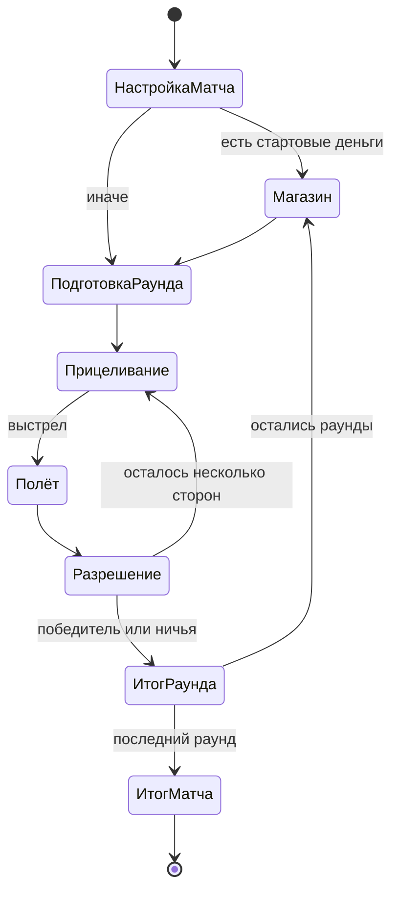

# Спецификация игрового дизайна

- **Статус:** vertical slice реализован; MVP и fidelity milestone предложены
- **Обновлено:** 2026-07-28
- **Область:** первый вертикальный срез, MVP и путь к каноническому ruleset

## 1. Продуктовая формула

Browser-first пошаговая артиллерия с разрушаемым рельефом и экономикой между
раундами. Механическое ядро следует Scorched Earth 1.5, а управление, темп и
визуальная подача создаются заново для телефона.

Основное обещание хода:

> Я прицелился, сделал рискованный выбор, увидел уникальное шоу и понял, как
> именно оно изменило поле боя.

## 2. Основной цикл

1. Матч получает ruleset, игроков, число раундов и seed.
2. Генерируются рельеф, ветер и позиции танков.
3. Активный игрок выбирает оружие, угол и силу; при наличии — защиту,
   guidance, trigger или движение.
4. Симуляция рассчитывает полёт, столкновения, payload, урон и изменение
   материала.
5. Presentation проигрывает те же события в понятной хореографии.
6. После стабилизации рельефа начинается следующий ход либо подводится итог
   раунда.
7. Награда, проценты и продажа имущества формируют бюджет магазина.
8. После заданного числа раундов сравнивается итоговый результат.

## 3. Наборы правил

### Classic

Канонический режим. Его цель — максимально близко воспроизвести доступные
параметры версии 1.5: цены, размеры комплектов, роли оружия, базовую экономику,
ветер, гравитацию, защиту и взаимные контрмеры. Неясные формулы восстанавливаются
через эталонные эксперименты и помечаются уровнем уверенности.

UI, визуальный темп и названия публичного контента могут отличаться. Механика
Classic не меняется ради Quick Match без отдельного решения.

### Quick Match

Мобильный формат на 3–7 раундов. Он может менять число раундов, стартовый
бюджет, доступный arms level и скорость показа уже разрешённых событий, но
использует те же параметры конкретного оружия, урона и контрмер, что Classic.

### Sandbox

Будущий режим для настройки ветра, гравитации, стен, рельефа, экономики и
каталога. Он полезен для тестирования и наследует дух многочисленных опций
оригинала, но не входит в вертикальный срез.

## 4. Базовые правила боя

### Поле и размещение

- Мир двумерный и дискретный на уровне логического материала.
- Рельеф допускает пустоты, туннели и нависающие участки.
- Танки размещаются на доступной поверхности с минимальным безопасным
  расстоянием, определяемым ruleset.
- Ветер имеет направление и величину; изменение ветра между выстрелами —
  отдельная настройка.
- Границы могут получить разные режимы отражения и wraparound позже. Для
  вертикального среза достаточно открытых боковых границ.

### Прицеливание

- Игрок задаёт направление башни, угол и силу.
- Classic использует исходную шкалу силы до 1000 при полном состоянии танка и
  угол от 0 до 90 градусов относительно направления башни.
- Последние значения сохраняются к следующему ходу и допускают точную
  коррекцию на один шаг.
- Полная предсказанная траектория по умолчанию не показывается: это уничтожает
  навык поправки. Допустимы след прошлого выстрела, tracer-оружие и учебная
  подсказка.

### Разрешение выстрела

- Симуляция является единственным источником урона, деформации и расхода
  инвентаря.
- Оружие может лететь по баллистике, разделяться, катиться по поверхности,
  проникать в материал, создавать материал или действовать энергетическим
  лучом.
- Сложный payload разрешается в стабильном порядке, заданном данными оружия.
- После payload рельеф стабилизируется, танки падают или перемещаются, затем
  применяются fall damage, parachute и условия гибели.
- Анимацию можно ускорить после кульминации, но нельзя пропустить состояние,
  необходимое для понимания результата.

### Танк, защита и utility

- Состояние танка определяет его здоровье и максимальную силу выстрела. В
  Classic максимальная сила равна десятикратному оставшемуся состоянию, поэтому
  полученный урон одновременно сокращает выживаемость и дальность ответа.
- Batteries восстанавливают состояние и питают energy weapons.
- Shields поглощают или отклоняют внешние воздействия в зависимости от типа.
- Parachutes предотвращают опасное падение при выполнении порога срабатывания.
- Fuel позволяет двигаться по поверхности, расходуя больше на подъёме.
- Guidance и contact trigger расходуются на конкретный выстрел и не должны
  включаться незаметно.

## 5. Экономика и баланс

### Контракт баланса

1. [Справочник оригинала](../reference/original-game.md) — исходная таблица
   цен, комплектов, радиусов и настроек.
2. Для Classic найденное значение переносится без «улучшения по ощущениям».
3. Неизвестное значение сначала получает тестовый сценарий, результат
   оригинала и уровень уверенности; только затем — реализацию.
4. Любое намеренное отличие Classic оформляется решением с причиной,
   сравнением и playtest-данными.
5. Quick Match может менять доступность и темп экономики, но не скрыто
   подменять характеристики предмета с тем же идентификатором.

### Между раундами

- Игрок получает деньги за события, определённые scoring mode: урон, убийство,
  выживание и/или net worth.
- Неистраченные деньги переходят дальше и могут приносить проценты.
- Товары покупаются комплектами; инвентарь одного типа ограничен.
- Предметы можно продавать с дисконтом; динамический рынок — опциональная
  поздняя возможность.
- Базовый снаряд доступен всегда, даже при нулевом балансе.
- Для Quick Match допустим явно показанный минимальный доход проигравшего,
  только если playtest обнаружит необратимый snowball. В Classic такой
  catch-up не добавляется автоматически.

### Что измерять

- pick rate и фактическую стоимость одного полезного попадания;
- урон, изменение материала, вероятность промаха и время разрешения;
- остаточный капитал победителей и проигравших;
- долю матчей, где лидер после раннего раунда становится недосягаем;
- случаи, когда предмет не имеет осмысленной цели или контрмеры.

## 6. Mobile-first UX

Основной бой работает в альбомной ориентации:

- поле занимает почти весь экран;
- сверху видны активный игрок, состояние, ветер и номер раунда;
- снизу слева находятся угол и крупные кнопки точной коррекции;
- снизу справа — сила и защищённая от случайного касания кнопка огня;
- по центру открывается сворачиваемая карусель оружия с количеством, ролью и
  ценностью текущего расхода;
- drag по свободному полю двигает камеру, pinch меняет масштаб;
- автокамера сопровождает projectile и задерживается на результате;
- интерактивные цели проектируются не меньше 48 CSS px;
- учитываются safe-area insets и динамические панели мобильного браузера;
- в портретной ориентации показывается короткое приглашение повернуть
  устройство, а не сломанная уменьшенная сцена;
- на современных широких iPhone короткая высота экрана включает compact layout,
  даже если ширина landscape viewport превышает типичный tablet breakpoint.

Fire control должен различаться визуально и пространственно с точной настройкой.
Случайный жест камеры или закрытие панели не может выпустить дорогое оружие.

Desktop использует тот же layout с мышью, колесом и клавиатурными shortcut,
но не является отдельным UI.

## 7. Контентные этапы

### Вертикальный срез

Один полностью законченный мини-матч:

- два управляемых людьми танка в local hot-seat;
- одна тема процедурного рельефа;
- три раунда и магазин между раундами;
- ветер, состояние танка, победа, ничья и повторный старт;
- пять образцовых механик:
  1. базовый баллистический снаряд;
  2. разделяющийся cluster;
  3. подземный digger;
  4. катящийся по поверхности заряд;
  5. создающий материал снаряд или shield;
- для всех пяти — законченные VFX, звук, camera response и читаемый aftermath;
- полный touch-flow на реальном телефоне.

Срез доказывает архитектуру и удовольствие от выстрела, а не размер каталога.

### MVP

- 1–4 танка, локальный hot-seat и bots;
- Quick Match на 3–7 раундов;
- две темы поля с процедурными вариациями;
- 10–12 видов оружия из разных функциональных семейств;
- 2–3 defensive/utility предмета;
- три уровня bot, отличающиеся погрешностью и выбором тактики, а не доступом к
  скрытой информации;
- короткое интерактивное обучение;
- настройки звука, camera shake, интенсивности эффектов и reduced motion;
- локальное хранение настроек и необязательной статистики.

### Fidelity milestone

После MVP добавляются семейства и контрмеры из версии 1.5, канонические
экономические режимы, больше вариантов стен/ландшафта и эталонный набор
black-box сценариев. Полный каталог не блокирует ранний релиз, но Classic не
называется полным до прохождения этой проверки.

## 8. Проверяемые гипотезы

Это цели playtest, а не уже достигнутые показатели:

- первый самостоятельный выстрел — не позже 90 секунд;
- медианное решение после обучения — до 20 секунд;
- трёхраундовый матч — 8–12 минут;
- не менее 80% тестеров после одного применения правильно описывают функцию
  оружия и отделяют урон от декорации;
- случайные выстрелы из-за touch-ошибки — менее 5% ходов;
- ни один предмет одного ценового класса не получает больше 35% покупок без
  объяснимой ситуационной причины;
- после третьего просмотра игроку всё ещё нравится эффект, но он не пытается
  постоянно его пропустить;
- проигравший раунд сохраняет минимум два осмысленных варианта покупки;
- тяжёлый разрешённый эффект не опускается ниже 30 fps на выбранном среднем
  Android-устройстве; обычный бой целится в плавные 60 fps.

## 9. Не входит в MVP

- онлайн, backend, аккаунты и matchmaking;
- скрытая прогрессия характеристик или pay-to-win;
- campaign и мета-карта;
- пользовательские карты и scripting оружия;
- полная эмуляция всех конфигурационных опций версии 1.5;
- обязательный offline/PWA режим;
- публичное использование оригинальных ассетов и текстов.

## 10. Открытые вопросы

- Финальное название и визуальная тема: чистые современные формы или
  современная интерпретация pixel-art.
- Точный Android reference device и минимальный GPU.
- Этап, на котором после hot-seat vertical slice появляется первый bot.
- Нужно ли скрывать покупки игроков друг от друга в local pass-and-play.
- Какая часть формул оригинального scoring может быть достоверно восстановлена.
- Нужен ли в первом релизе полноценный Classic или достаточно пометки
  «Classic preview».
