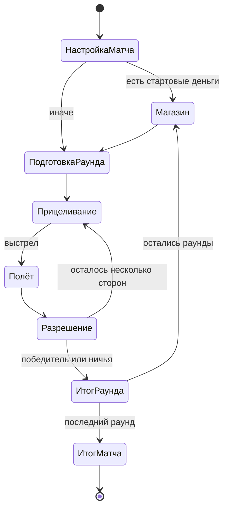

# Спецификация игрового дизайна

- **Статус:** ruleset Quick Demo принят; полный Classic остаётся целью fidelity
- **Обновлено:** 2026-07-28
- **Область:** Quick Demo с полным arsenal и путь к каноническому ruleset

## 1. Продуктовая формула

Browser-first пошаговая артиллерия с разрушаемым рельефом и экономикой между
раундами. Механическое ядро следует Scorched Earth 1.5, а управление, темп и
визуальная подача создаются заново для телефона.

Основное обещание хода:

> Я прицелился, сделал рискованный выбор, увидел уникальное шоу и понял, как
> именно оно изменило поле боя.

## 2. Основной цикл

1. Матч получает ruleset, игроков, число раундов и seed.
2. Генерируются рельеф, ветер и позиции танков.
3. Активный игрок выбирает оружие, угол и силу; при наличии — защиту,
   guidance, trigger или движение.
4. Симуляция рассчитывает полёт, столкновения, payload, урон и изменение
   материала.
5. Presentation проигрывает те же события в понятной хореографии.
6. После стабилизации рельефа начинается следующий ход либо подводится итог
   раунда.
7. Награда, проценты и продажа имущества формируют бюджет магазина.
8. После заданного числа раундов сравнивается итоговый результат.

## 3. Наборы правил

### Classic

Канонический режим. Его цель — максимально близко воспроизвести доступные
параметры версии 1.5: цены, размеры комплектов, роли оружия, базовую экономику,
ветер, гравитацию, защиту и взаимные контрмеры. Неясные формулы восстанавливаются
через эталонные эксперименты и помечаются уровнем уверенности.

UI, визуальный темп и названия публичного контента могут отличаться. Механика
Classic не меняется ради Quick Demo без отдельного решения.

### Quick Demo

Принятый релизный формат для двух игроков на три раунда. Он показывает весь
каталог из 33 weapons, но не выдаёт provisional mechanics за полную реплику
Classic:

- Baby Missile доступна без ограничения;
- каждый игрок начинает матч с одним finite shot каждого из остальных 32
  weapons, чтобы весь arsenal можно было проверить без предварительного grind;
- цена bundle, bundle size, arms level, лимит 99 и default interest `5%`
  переносятся из manual;
- неизвестные damage, payout, sale и material formulas задаются собственными
  детерминированными профилями и явно считаются **НЕ каноническими**;
- accessories, полный набор scoring modes и Free Market остаются за границей
  Quick Demo.

Начальный shot каждого weapon — демонстрационное отличие. Оно не переносится в
Classic, где default начинается с бесконечной Baby Missile и нулевого cash.

### Infinite Arsenal / Showcase

Явно выбираемый неканонический вариант Quick Demo. Он сохраняет ту же seeded
симуляцию, damage profiles, баллистику, ветер, рельеф, порядок ходов и VFX, но
меняет только ammo policy и межраундовый переход:

- все 33 weapons доступны обоим игрокам без расхода inventory;
- selector и current-weapon control показывают `∞`, не фиктивное большое
  число;
- player-owned выбор оружия, угол и сила остаются независимыми;
- payout, purchase, sale, inventory cap и interest не влияют на доступность;
- магазин между раундами пропускается, результат и число побед сохраняются;
- постоянный badge `Infinite Arsenal` отличает showcase от Quick Demo.

Новый матч по умолчанию снова предлагает Quick Demo; Infinite Arsenal не
переносится скрыто между сессиями. Режим не считается Classic parity и не
меняет характеристики самих weapons.

### Sandbox

Будущий режим для настройки ветра, гравитации, стен, рельефа, экономики и
каталога. Он полезен для тестирования и наследует дух многочисленных опций
оригинала, но не входит в вертикальный срез.

## 4. Базовые правила боя

### Поле и размещение

- Мир двумерный и дискретный на уровне логического материала.
- Рельеф допускает пустоты, туннели и нависающие участки.
- Танки размещаются на доступной поверхности с минимальным безопасным
  расстоянием, определяемым ruleset.
- Ветер имеет направление и величину; изменение ветра между выстрелами —
  отдельная настройка.
- Границы могут получить разные режимы отражения и wraparound позже. Для
  вертикального среза достаточно открытых боковых границ.

### Прицеливание

- Игрок задаёт направление башни, угол и силу.
- Classic использует исходную шкалу силы до 1000 при полном состоянии танка и
  угол от 0 до 90 градусов относительно направления башни.
- Последние значения сохраняются к следующему ходу и допускают точную
  коррекцию на один шаг.
- Полная предсказанная траектория по умолчанию не показывается: это уничтожает
  навык поправки. Допустимы след прошлого выстрела, tracer-оружие и учебная
  подсказка.

### Разрешение выстрела

- Симуляция является единственным источником урона, деформации и расхода
  инвентаря.
- Оружие может лететь по баллистике, разделяться, катиться по поверхности,
  проникать в материал, создавать материал или действовать энергетическим
  лучом.
- Сложный payload разрешается в стабильном порядке, заданном данными оружия.
- После payload рельеф стабилизируется, танки падают или перемещаются, затем
  применяются fall damage, parachute и условия гибели.
- Анимацию можно ускорить после кульминации, но нельзя пропустить состояние,
  необходимое для понимания результата.

### Танк, защита и utility

- Состояние танка определяет его здоровье и максимальную силу выстрела. В
  Classic максимальная сила равна десятикратному оставшемуся состоянию, поэтому
  полученный урон одновременно сокращает выживаемость и дальность ответа.
- Batteries восстанавливают состояние и явно питают Plasma Blast; battery
  behavior Laser требует дополнительной проверки оригинала.
- Shields поглощают или отклоняют внешние воздействия в зависимости от типа.
- Parachutes предотвращают опасное падение при выполнении порога срабатывания.
- Fuel позволяет двигаться по поверхности, расходуя больше на подъёме.
- Guidance и contact trigger расходуются на конкретный выстрел и не должны
  включаться незаметно.

## 5. Экономика и баланс

### Контракт баланса

1. [Справочник оригинала](../reference/original-game.md) — исходная таблица
   цен, комплектов, радиусов и настроек.
2. Для Classic найденное значение переносится без «улучшения по ощущениям».
3. Неизвестное значение сначала получает тестовый сценарий, результат
   оригинала и уровень уверенности; только затем — реализацию.
4. Любое намеренное отличие Classic оформляется решением с причиной,
   сравнением и playtest-данными.
5. Quick Demo может менять доступность и темп экономики, но не скрыто
   подменять характеристики предмета с тем же идентификатором.
6. Infinite Arsenal меняет только явную ammo/interround policy; mechanical
   outcome одного seeded shot совпадает с Quick Demo.

### Принятый контракт Quick Demo

- Все 33 weapons имеют source-backed price, bundle size, arms level и
  справочный blast radius.
- Catalog хранит canonical `classicName` отдельно от собственного публичного
  названия. Funky Bomb сохраняет исходное имя как явное исключение по прямому
  запросу владельца; это не разрешение копировать исходные тексты или assets.
- Инвентарь finite weapon не превышает 99.
- Матч начинается с `cash = 0`; магазин впервые получает бюджет из provisional
  round payout.
- Покупка добавляет canonical bundle, а не один projectile. Если до cap
  помещается только часть, demo считает цену как
  `ceil(catalogPrice × quantity × 1.2 / bundleSize)`: manual подтверждает лишь
  приблизительный markup `20%`, а не эту общую формулу.
- Неистраченный cash переносится дальше; после покупок и продаж перед новым
  раундом применяется canonical rate `5%` ко всему текущему balance.
  Округление `floor(cash × 0.05)` является **НЕ канонической** deterministic
  policy Quick Demo.
- Выдача одного finite shot каждого weapon происходит только при старте матча
  и не меняет стоимость последующих покупок.
- Продажа идёт по одному shot за
  `floor(catalogPrice × quantity × 0.60 / bundleSize)`. Rate `60%`, округление
  и отсутствие quantity-dependent offer являются **НЕ каноническими**.
- Все `demoResolution` damage profiles являются deterministic, provisional и
  **НЕ каноническими**.
- Round payout равен
  `7000 + round(weightedDamage × 55) + 2500 за победу`; это также
  **НЕ каноническая** временная формула.
- Funky Bomb использует `10–14` seeded chain nodes. Это принятое
  mechanics/presentation решение Quick Demo, а не установленный факт
  оригинала.
- Free Market, quantity-dependent offers, каноническое scoring и неизвестное
  округление процентов не имитируются до отдельных black-box сценариев.

### Общий контракт между раундами

- В Classic игрок получает деньги за события, определённые scoring mode: урон,
  убийство, выживание и/или net worth. Quick Demo использует раскрытую выше
  provisional payout formula.
- Неистраченные деньги переходят дальше и могут приносить проценты.
- Товары покупаются комплектами; инвентарь одного типа ограничен.
- Предметы можно продавать с дисконтом; динамический рынок — опциональная
  поздняя возможность.
- Базовый снаряд доступен всегда, даже при нулевом балансе.
- Базовые `7000` Quick Demo получают оба игрока, чтобы после первого раунда
  открыть осмысленный магазин. Это demo pacing, а не скрытое правило Classic.

### Что измерять

- pick rate и фактическую стоимость одного полезного попадания;
- урон, изменение материала, вероятность промаха и время разрешения;
- остаточный капитал победителей и проигравших;
- долю матчей, где лидер после раннего раунда становится недосягаем;
- случаи, когда предмет не имеет осмысленной цели или контрмеры.

## 6. Mobile-first UX

Основной бой работает в альбомной ориентации:

- поле занимает почти весь экран;
- сверху видны активный игрок, состояние, ветер и номер раунда;
- снизу слева находятся угол и крупные кнопки точной коррекции;
- снизу справа — сила и защищённая от случайного касания кнопка огня;
- по центру открывается сворачиваемая карусель оружия с количеством, ролью и
  ценностью текущего расхода;
- drag по свободному полю двигает камеру, pinch меняет масштаб;
- автокамера сопровождает projectile и задерживается на результате;
- интерактивные цели проектируются не меньше 48 CSS px;
- учитываются safe-area insets и динамические панели мобильного браузера;
- в портретной ориентации показывается короткое приглашение повернуть
  устройство, а не сломанная уменьшенная сцена;
- на современных широких iPhone короткая высота экрана включает compact layout,
  даже если ширина landscape viewport превышает типичный tablet breakpoint.

Fire control должен различаться визуально и пространственно с точной настройкой.
Случайный жест камеры или закрытие панели не может выпустить дорогое оружие.

Desktop использует тот же layout с мышью, колесом и клавиатурными shortcut,
но не является отдельным UI.

## 7. Контентные этапы

### Quick Demo

Релизный demo scope:

- два управляемых людьми танка в local hot-seat;
- одна тема процедурного рельефа;
- три раунда, round rewards, interest и магазин между раундами;
- полный каталог из 33 weapons с одним стартовым finite shot каждого;
- канонические price, bundle size, arms level и inventory cap;
- детерминированные provisional mechanics для неизвестных формул;
- уникальные cues семейства, усиленная хореография Funky Bomb, звук, camera
  response и читаемый aftermath;
- touch-, mouse- и keyboard-flow в одном интерфейсе.

Наличие полного списка weapons не означает полный Classic: функциональная
точность отдельных payload и денежные коэффициенты всё ещё требуют эталонных
экспериментов.

### Fidelity milestone

Следующий этап добавляет и проверяет:

- accessories и их сеть контрмер;
- battery scaling Plasma/Laser и иммунитет Super Mag;
- pool-depth heat Napalm и direct-tank fizzle Digger;
- Basic, Standard и Greedy с восстановленными денежными коэффициентами;
- quantity-dependent selling и Free Market;
- варианты стен, landscape и расширенные physics options;
- bots без скрытой информации;
- эталонные black-box сценарии для неизвестных weapon formulas;
- performance trace и полный touch-flow на обозначенном физическом устройстве.

Classic не называется полным до прохождения этой проверки.

## 8. Проверяемые гипотезы

Это цели playtest, а не уже достигнутые показатели:

- первый самостоятельный выстрел — не позже 90 секунд;
- медианное решение после обучения — до 20 секунд;
- трёхраундовый матч — 8–12 минут;
- не менее 80% тестеров после одного применения правильно описывают функцию
  оружия и отделяют урон от декорации;
- случайные выстрелы из-за touch-ошибки — менее 5% ходов;
- ни один предмет одного ценового класса не получает больше 35% покупок без
  объяснимой ситуационной причины;
- после третьего просмотра игроку всё ещё нравится эффект, но он не пытается
  постоянно его пропустить;
- проигравший раунд сохраняет минимум два осмысленных варианта покупки;
- тяжёлый разрешённый эффект не опускается ниже 30 fps на выбранном среднем
  Android-устройстве; обычный бой целится в плавные 60 fps.

## 9. Не входит в Quick Demo

- онлайн, backend, аккаунты и matchmaking;
- скрытая прогрессия характеристик или pay-to-win;
- campaign и мета-карта;
- пользовательские карты и scripting оружия;
- полный каталог accessories и доказанный паритет их контрмер;
- канонические scoring, sell-back и Free Market formulas;
- полная эмуляция всех конфигурационных опций версии 1.5;
- обязательный offline/PWA режим;
- публичное использование оригинальных ассетов и текстов.

## 10. Открытые вопросы

- Финальное название и визуальная тема: чистые современные формы или
  современная интерпретация pixel-art.
- Точный Android reference device и минимальный GPU.
- Этап, на котором после hot-seat Quick Demo появляется первый bot.
- Нужно ли скрывать покупки игроков друг от друга в local pass-and-play.
- Какая часть формул оригинального scoring может быть достоверно восстановлена.
- Какие provisional weapon и economic profiles первыми отправить на
  black-box сравнение с оригиналом.
