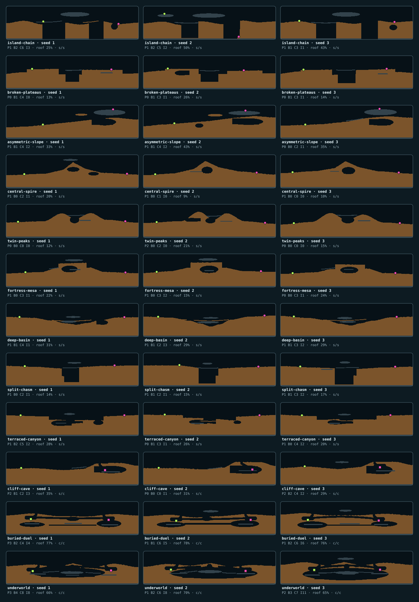

# Проверка композиционных battlefield layouts 0.1

- **Статус:** phase-2 local candidate; production v29 содержит предыдущий
  progress release, пользовательская приёмка не завершена
- **Families:** `open`, `ridge`, `valley`, `cavern`
- **Motifs:** 12, по три на семейство
- **Размер fixture:** `2880×720`

## Gallery

Все gallery пересобираются командой `npm run gallery:battlefield`. Первая
показывает по три motif каждого семейства на общем seed. Вторая ставит рядом
три same-motif instantiation с разными seeds. Blind-вариант перемешивает все
`12 × 3 = 36` карт и скрывает labels: различие должно читаться по материалу и
spawn markers. Круг означает surface spawn, квадрат — cave spawn; цвет
различает игроков.

## Автоматические критерии

`tests/battlefield.test.ts` проверяет:

- plan sweep `512` seeds: каждое семейство не меньше `15%`, ни одно не больше
  `50%`, три раунда не повторяют один профиль;
- replay equality для plan, grid hash, spawns, attempt/fallback и metadata;
- полноразмерный fixture каждого из 12 motif;
- `ridge`/`valley` feature не меньше `10%` высоты мира и `160` world units;
- feature width измеряется по final grid, а не читается из plan envelope;
- island/asymmetric motif сохраняют отдельный floating component;
- `asymmetric-slope` разводит spawn по высоте минимум на `30%` высоты мира;
- plateau/mesa сохраняют минимум два cliff transitions;
- `buried-duel`/`underworld` сохраняют широкие roofed coverage и air span;
- silhouette distance между motif одного семейства на общем seed больше
  `0.035`, включая зеркальное сопоставление;
- coarse `32×12` occupancy signature измеряет внутренний объём независимо от
  top silhouette: отдельный fixture вырезает cave, не меняя поверхность, и
  обязан дать ненулевую distance;
- same-motif sweep строит восемь seeds каждого из 12 motif: lower quartile
  pairwise silhouette distance больше `0.02`, occupancy distance больше
  `0.08`, все восемь variation signatures различны, а optional feature count
  реализует и один, и два secondary features;
- оба spawn axes имеют ненулевой диапазон, cave spawn — больше `20` cells на
  fixture `960×360`; cavern corpus реализует минимум два route classes;
- variation candidate успешного plan совпадает с `attempt - 1`, поэтому
  retry действительно пересэмплирует same-motif композицию;
- surface support/open sky и cave floor/headroom/roof/mouth/firing exit;
- отдельные `surface-vs-cave` и `cave-vs-cave`;
- default motif generation не наследует случайный legacy cave pass;
- exact motif и явно выбранный profile либо остаются exact, либо завершаются
  явной ошибкой — fallback не имеет права незаметно подменить fixture;
- автоматический open fallback заново рассчитывает и проверяет spawn
  separation по контракту собственного motif, а не исходного профиля;
- scaled sweep проходит все 12 motif на нескольких seeds;
- bounded retry corpus с fallback rate меньше `5%` и средним числом попыток
  меньше `2`; retry budget обязан быть целым числом от `1` до `12`.

## Browser smoke

Query `?layout=open|ridge|valley|cavern` принудительно выбирает семейство,
`?motif=<id>` — точный motif, `?seed=<integer>` — воспроизводимый match seed.
Без `seed` новый матч получает новый явный browser seed. Значения отражаются
в `data-match-seed`, `data-battlefield-profile`,
`data-battlefield-motif` и `data-*-spawn-kind`. На representative motif:

1. выключить music и SFX до начала теста;
2. начать Quick Match и проверить полный контур через minimap;
3. вернуть камеру к обоим танкам; для cave spawn подтвердить видимую крышу,
   пол и вход;
4. сделать legal shot Star Shell и дождаться возврата в aiming;
5. повторить desktop viewport и short-height mobile viewport;
6. проверить отсутствие console/page errors.

Физический iPhone остаётся отдельной проверкой пользователя: desktop browser
и mobile viewport не доказывают touch-performance или удобство на устройстве.

## Performance corpus

`npm run benchmark:battlefield -- baseline|current` строит одинаковый corpus
из `24` полноразмерных карт: по два seed каждого motif. Baseline повторяет
прежний pipeline
`generateTerrain → findSpawnSites`; current использует profile planner,
2D material operations, paired/cave spawn, independent structure metrics и
final validator.

Локальный phase-2 candidate на 2026-07-29: baseline `11.0 ms/map`, current
`60.2 ms/map`, среднее число попыток `1.08`, fallback `0/24`. Это generation
benchmark на текущем Mac, а не frame time и не измерение физического телефона.
Актуальные release-числа фиксируются на release commit отдельным процессом
через `/usr/bin/time -l`.
